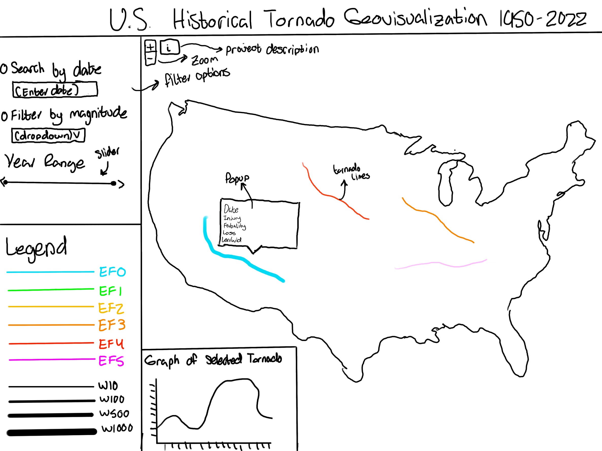

# Team Name

### Team Members
1. Ryan Mroczenski
2. Dane Bach
3. Nicholas Sapp

### Outline 
1. We aim to map weather events throughout the United States over a period of time, most likely the past 20 years. We will use data from NOAA to map the paths of tornados and include other information such as damage, magnitude, length, and cost. We will also include other graphics such as descriptions, charts, and other supporting information. 

### Proposal
1. Persona/ Scenario 
    Target User Profile (Persona): Name & Position: Ben Jensen, National Weather Service Meteorologist Background Description: Ben Jensen is a dedicated meteorologist at the National Weather Service (NWS), with a specialized focus on monitoring and analyzing tornado activity across the United States. Given the critical nature of his work in forecasting, understanding, and mitigating the impacts of tornadoes, Ben is deeply involved in the study and management of comprehensive tornado data collected by the NWS. This dataset, extending back to 1950, encompasses various parameters such as wind speed, path length and width, total damage in USD, fatalities, injuries, and more, aiming to categorize and understand the intensity and impact of past tornadoes. However, Ben faces challenges in visualizing and comparing this extensive data effectively. The current system lacks the capability for intuitive data exploration, making it difficult to compare tornado events directly or filter them by specific criteria such as year, location, severity, or other key variables.
    
    The primary objective is to enhance the NWS’s capability to analyze tornado events through better data analysis and visualization tools. He is looking for a solution that allows for easy comparison of tornado events side by side, including the ability to filter and sort by various criteria like date range, geographic location, tornado intensity, and impact metrics such as damage and casualties. This will enable a more nuanced understanding of tornado patterns, seasonal variations, and potential trends over time, which is crucial for improving forecasting accuracy and public safety measures.

2. User Scenarios 

    Scenario #1:  

    The user is tasked with determining where to allocate public safety resources for future tornadoes. To do this, they want to examine the severity and injuries. The user arrives at the interactive and wants to use data from the last five years, so they set the years to include the last five on the slider. From the dropdown menu, the user selects to compare by magnitude. They opt to deselect EF0 because they are not interested in tornadoes that cause minor damage, as well as EF5 their rarity, considering them outliers. The user proceeds to filter through the magnitude scale, deselecting options as they identify where the most severe tornadoes occur. The interactive gives them the idea of where most severe tornadoes take place and their path. Next, the user wants to see the magnitude and location/ paths that result in the most injuries. The user selects injuries from the dropdown menu and compares the paths of the ones that result in the greatest injuries based on the legend, indicating the scale.  

    Scenario #2:

    An employee with the National Weather Service is tasked with finding out when tornadoes are the most common to aid in preparedness. The user arrives at the interactive and sees the graph on the page that shows the number of tornadoes each month based on the years that were prepopulated. The user decides to look at data for the past twenty years, so they adjust the year scale bar to show the past twenty. The user then looks at the graph to compare the number of tornadoes that occur each month. The user then identifies the month in which the most tornadoes occur.  

    Scenario #3: 

    A user recalls a tornado that went through his hometown as a child and wants to “find it” and learn more about it. The user knows that exact year it took place, 2015, but not much else, so they set the year's scale to only include that year. Next, they zoom into their hometown to see all the tornadoes and their paths that occurred that year. The user recalls that one person died so they select the dropdown and filter by fatalities. They compare the colors on the legend to colors on the map and find the path that resulted in one fatality. The user identifies the path of the specific tornado they recalled as a child and clicks its path on the map. The user is then presented with a pop-up that provides all the details relating to the tornado. 

3. Required Document 

    Representation:

    Basemap: (dark) natural earth or street map layer 
    Tornado Paths: depicted by lines from start location to end location  
    Legend: visual description of presented data 
    Tornadoes per Month: bar chart  

    Interaction:  

    Query Panel: filter by date  
    Dropdown panel: filter by magnitude, # of injuries, # of fatalities  
    Legend Toggle: overlay: turn on/off certain data  
    Timeline: sequence by year  
    Path Hover: retrieve information on specific tornado  
    Chart Hover: retrieve: hover over bar chart to get values  
    Reexpress: cyclical time  

    

